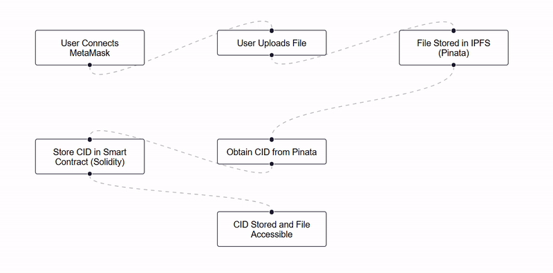

# 🚀 Decentralized File Storage

A decentralized file storage system leveraging **IPFS**, **Ethereum Smart Contracts**, and **Infura API**. Built with **React, Tailwind CSS, Solidity, and Web3.js**.

## 📂 Project Structure

```
├── Images/    # Images used in readme file
├── backend/   # Smart contracts and deployment scripts
├── drive/     # Frontend application
├── README.md  # Project documentation
```

## 🛠️ Tech Stack

### Frontend
- **React** & **Tailwind CSS** for a seamless UI
- **React Router** for navigation
- **Framer Motion** for animations
- **Axios** for API requests
- **Web3.js** for Ethereum interactions

### Backend (Smart Contracts)
- **Solidity** for smart contract development
- **Truffle HDWallet Provider** for contract deployment
- **Web3.js** to interact with Ethereum
- **IPFS & Pinata** for file storage

## 📦 Installation

### Clone the Repository
```sh
git clone https://github.com/praveenyadav2005/IE.git
cd IE
```

### Frontend Setup
```sh
cd drive
npm install
npm run dev
```

### Backend Setup
```sh
cd backend
npm install
```

## 🚀 Usage

### Deploy Smart Contracts
```sh
node compile.js
node deploy.js
```


## 🔗 Architecture



## 📜 Smart Contract
- **Written in Solidity**
- Stores the **CID** (Content Identifier) of each file
- Uses **Infura API** to interact with Ethereum

## ⚡ Features
- ✅ Decentralized file storage on **IPFS**
- ✅ Smart contract-based authentication
- ✅ Seamless UI with **React & Tailwind CSS**
- ✅ Blockchain interaction using **Web3.js**


---

🔗 **Live Project link:** [IE](#)


